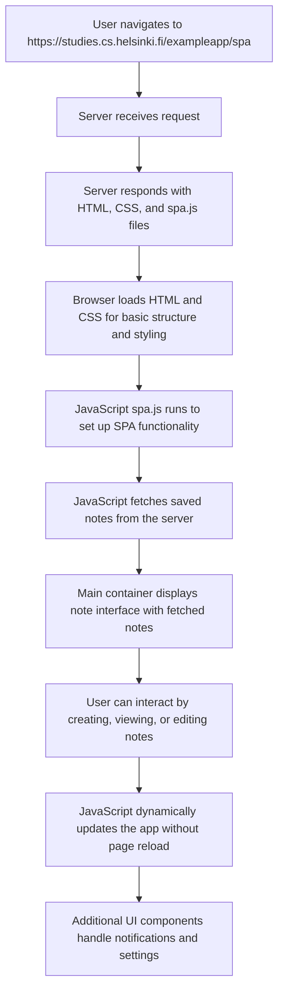

```mermaid

flowchart TD
    A[User navigates to https://studies.cs.helsinki.fi/exampleapp/spa] --> B[Server receives request]
    B --> C[Server responds with HTML, CSS, and spa.js files]
    C --> D[Browser loads HTML and CSS for basic structure and styling]
    D --> E[JavaScript spa.js runs to set up SPA functionality]
    E --> F[JavaScript fetches saved notes from the server]
    F --> G[Main container displays note interface with fetched notes]
    G --> H[User can interact by creating, viewing, or editing notes]
    H --> I[JavaScript dynamically updates the app without page reload]
    I --> J[Additional UI components handle notifications and settings]

```